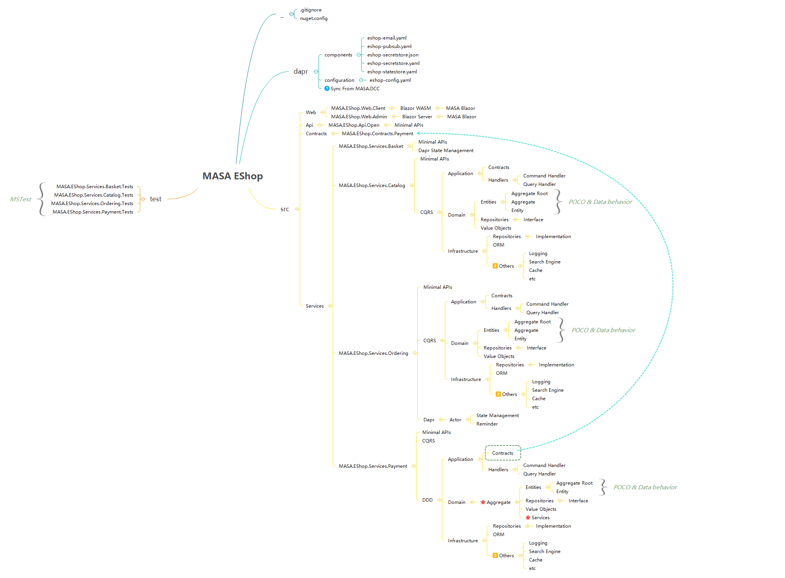
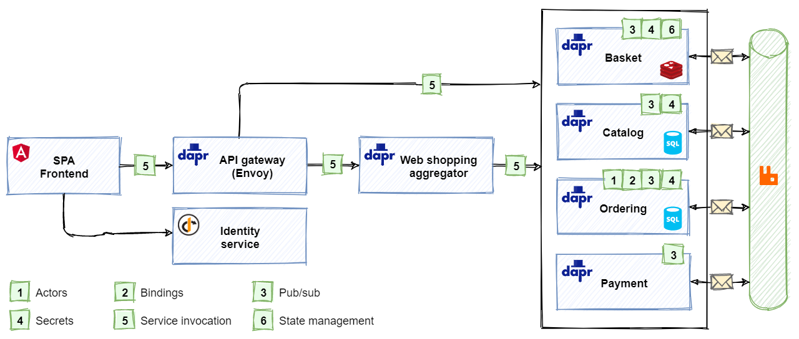
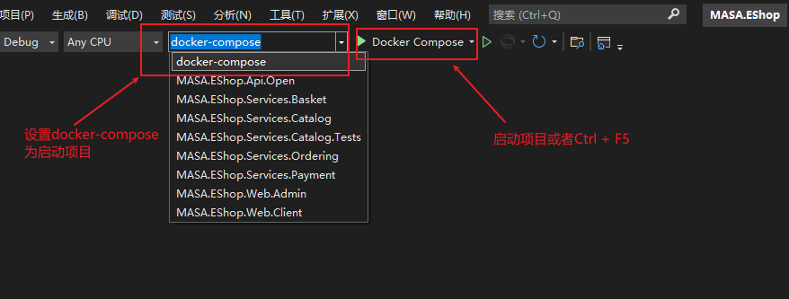
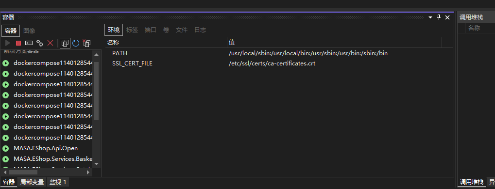
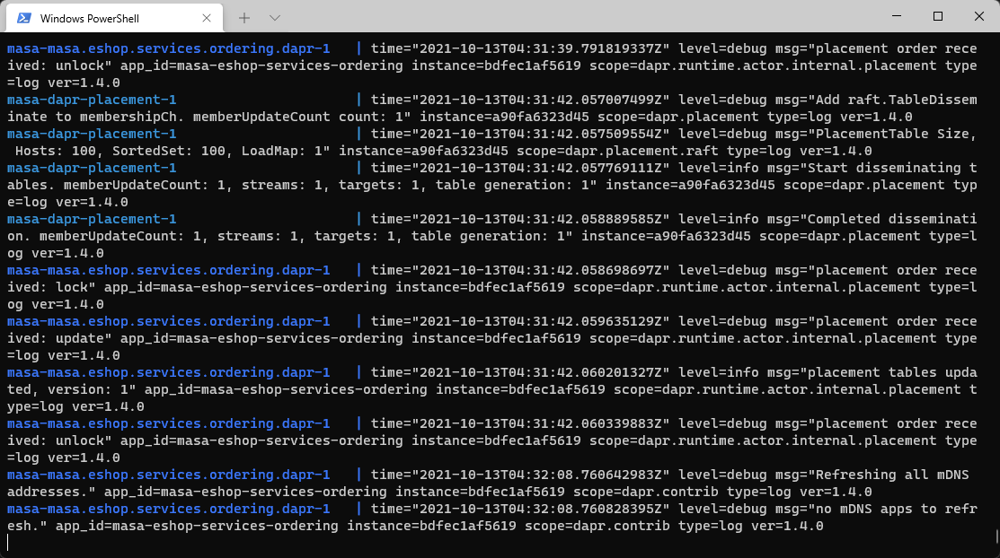

# <center>MASA.EShop</center>

# 介�

## 目录结�

```
MASA.EShop
├── dapr
�  ├── components                           dapr本地组件定义目录
�  �  ├── pubsub.yaml                      �布订阅�置文件
�  �  └── statestore.yaml                  状�管��置文�
├── src                                      �文件目�
�  ├── Api
�  �  └── MASA.EShop.Api.Open              BFF层，�供��给Web.Client
�  ├── Contracts                            公用元素��，如�务间通信的Event Class
�  �  ├── MASA.EShop.Contracts.Basket
�  �  ├── MASA.EShop.Contracts.Catalog
�  �  ├── MASA.EShop.Contracts.Ordering
�  �  └── MASA.EShop.Contracts.Payment
�  ├── Services                             �务拆分
�  �  ├── MASA.EShop.Services.Basket
�  �  ├── MASA.EShop.Services.Catalog
�  �  ├── MASA.EShop.Services.Ordering
�  �  └── MASA.EShop.Services.Payment
�  ├── Web
�  �  ├── MASA.EShop.Web.Admin
�  �  └── MASA.EShop.Web.Client
├── test
|   └── MASA.EShop.Services.Catalog.Tests
├── docker-compose                          docker-compose �务�置
�  ├── MASA.EShop.Web.Admin
�  └── MASA.EShop.Web.Client
├── .gitignore                               git�交的忽略文�
├── LICENSE                                  项目许�
├── .dockerignore                            docker�建的忽略文�
└── README.md                                项目说�文件
```

## 项目结�



## 项目��（待更新�



## 快速入�

- 准备工作

  - Docker
  - VS 2022
  - .Net 6.0
  - Dapr

- �动项目

  - VS 2022(��)

    设置 docker-compose 为�动项�Ctrl + F5 �动�

    

    �动��以看到容器视图的对应输出

    

  - CLI

    项目根目录下执行命令

    ```
    docker-compose build
    docker-compose up
    ```

    �动�效�

    

  - VS Code (Todo)

- �动效�

  Baseket Service: http://localhost:8081/swagger/index.html  
  Catalog Service: http://localhost:8082/swagger/index.html  
  Ordering Service: http://localhost:8083/swagger/index.html  
  Payment Service: http://localhost:8084/swagger/index.html

## 特�

#### MinimalAPI

项目中的�务使用 .Net 6.0 新��Minimal API 方�代替�有�Web API ��

> 更多 Minimal API 内容�考[mvc-to-minimal-apis-aspnet-6](https://benfoster.io/blog/mvc-to-minimal-apis-aspnet-6/)

```C#
var builder = WebApplication.CreateBuilder(args);
var app = builder.Build();
app.MapGet("/api/v1/helloworld", ()=>"Hello World");
app.Run();
```

`MASA.Contrib.Service.MinimalAPIs`�Minimal API 进一步��修改代��

```C#
var builder = WebApplication.CreateBuilder(args);
var app = builder.Services.AddServices(builder);
app.Run();
```

```C#
public class HelloService : ServiceBase
{
    public HelloService(IServiceCollection services): base(services) =>
        App.MapGet("/api/v1/helloworld", ()=>"Hello World"));
}
```

> �加�ServiceBase 类（相当�ControllerBase），使用时定义自己的 Service 类（相当�Controller），在�造函数中维护路由注册。`AddServices(builder)`方法会找到所有�务类完�注册。继�ServiceBase 类为�例模�,�造函数注入��以注入�例，如 ILogger,仓储�Repostory 等应该借助 FromService ��方法注入�

#### Dapr

官方 Dapr 使用介�，MASA.Contrib �装 Dapr ��使用��Event 部分

更多 Dapr 内容��https://docs.microsoft.com/zh-cn/dotnet/architecture/dapr-for-net-developers/

1. 添加 Dapr

```C#
builder.Services.AddDaprClient();
...
app.UseRouting();
app.UseCloudEvents();
app.UseEndpoints(endpoints =>
{
    endpoints.MapSubscribeHandler();
});
```

2. 订阅事件

```C#
 [Topic("pubsub", nameof(OrderStatusChangedToValidatedIntegrationEvent)]
 public async Task OrderStatusChangedToValidatedAsync(
     OrderStatusChangedToValidatedIntegrationEvent integrationEvent,
     [FromServices] ILogger<IntegrationEventService> logger)
 {
     logger.LogInformation("----- integration event: {IntegrationEventId} at {AppName} - ({@IntegrationEvent})", integrationEvent.Id, Program.AppName, integrationEvent);
 }
```

> Topic 第一个��pubsub 为�置文�pubsub.yaml 中指定的 name

3. �布事件

```C#
var @event = new OrderStatusChangedToValidatedIntegrationEvent();
await _daprClient.PublishEventAsync
(
    "pubsub",
    nameof(OrderStatusChangedToValidatedIntegrationEvent),
    @event
);
```

#### Actor

1. 项目中��Actor 支�

```C#
app.UseEndpoints(endpoint =>
{
    ...
    endpoint.MapActorsHandlers(); //Actor 支�
});
```

2. 定义 Actor ��，继�IActor�

```C#
public interface IOrderingProcessActor : IActor
{
```

3. ��`IOrderingProcessActor`，并继承`Actor`类。示例项目还��了`IRemindable`��，��该���通过方法`RegisterReminderAsync`完�注册�醒�

```C#
public class OrderingProcessActor : Actor, IOrderingProcessActor, IRemindable
{
    //todo
}
```

4. 注册 Actor

```C#
builder.Services.AddActors(options =>
{
    options.Actors.RegisterActor<OrderingProcessActor>();
});
```

5. Actor 调用代�

```C#
var actorId = new ActorId(order.Id.ToString());
var actor = ActorProxy.Create<IOrderingProcessActor>(actorId, nameof(OrderingProcessActor));
```

#### EventBus

仅支���进程内事件

1. 添加 EventBus

```C#
builder.Services.AddEventBus();
```

2. 自定�Event

```C#
public class DemoEvent : Event
{
    //todo 自定义�性事件��
}
```

3. ��Event

```C#
IEventBus eventBus;
await eventBus.PublishAsync(new DomeEvent());
```

4. 处�事件

```C#
[EventHandler]
public async Task DemoHandleAsync(DomeEvent @event)
{
    //todo
}
```

#### IntegrationEventBus

��跨进程事件，但当�时添�EventBus 时，也支�进程内事件

1. 添加 IntegrationEventBus

```C#
builder.Services
    .AddDaprEventBus<IntegrationEventLogService>();
//   .AddDaprEventBus<IntegrationEventLogService>(options=>{
//    	//todo
//   	options.UseEventBus();//添加EventBus
//	});
```

2. 自定�Event

```C#
public class DomeIntegrationEvent : IntegrationEvent
{
    public override string Topic { get; set; } = nameof(DomeIntegrationEvent);
    //todo 自定义�性事件��
}
```

> Topic �性值为 Dapr pub/sub 相关特�TopicAttribute 第二个�数的�

3. ��Event

```C#
public class DemoService
{
    private readonly IIntegrationEventBus _eventBus;

    public DemoService(IIntegrationEventBus eventBus)
    {
        _eventBus = eventBus;
    }

    //todo

    public async Task DemoPublish()
    {
        //todo
        await _eventBus.PublishAsync(new DomeIntegrationEvent());
    }
}
```

4. 处�事件

```C#
[Topic("pubsub", nameof(DomeIntegrationEvent))]
public async Task DomeIntegrationEventHandleAsync(DomeIntegrationEvent @event)
{
    //todo
}
```

#### CQRS

更多关� CQRS 文档请�考：https://docs.microsoft.com/en-us/azure/architecture/patterns/cqrs

##### Query

1. 定义 Query

```c#
public class CatalogItemQuery : Query<List<CatalogItem>>
{
	public string Name { get; set; } = default!;

	public override List<CatalogItem> Result { get; set; } = default!;
}
```

2. 添加 QueryHandler, 例：

```c#
public class CatalogQueryHandler
{
    private readonly ICatalogItemRepository _catalogItemRepository;

    public CatalogQueryHandler(ICatalogItemRepository catalogItemRepository) => _catalogItemRepository = catalogItemRepository;

    [EventHandler]
    public async Task ItemsWithNameAsync(CatalogItemQuery query)
    {
        query.Result = await _catalogItemRepository.GetListAsync(query.Name);
    }
}
```

3. ��Query

```C#
IEventBus eventBus;
await eventBus.PublishAsync(new CatalogItemQuery(){
	Name = "Rolex"
});//进程内使用使用IEventBus
```

##### Command

1. 定义 Command

```c#
public class CreateCatalogItemCommand : Command
{
	public string Name { get; set; } = default!;

    //todo
}
```

2. 添加 CommandHandler, 例：

```c#
public class CatalogCommandHandler
{
    private readonly ICatalogItemRepository _catalogItemRepository;

    public CatalogCommandHandler(ICatalogItemRepository catalogItemRepository) => _catalogItemRepository = catalogItemRepository;

    [EventHandler]
    public async Task CreateCatalogItemAsync(CreateCatalogItemCommand command)
    {
        //todo
    }
}
```

3. ��Command

```C#
IEventBus eventBus;
await eventBus.PublishAsync(new CreateCatalogItemCommand());//进程内使用使用IEventBus
```

#### DDD

DDD 更多内容��https://xie.infoq.cn/article/097316aecce39cdc5709e7d73

既�以���进程内事件�也���跨进程事件

1. 添加 DomainEventBus

```c#
.AddDomainEventBus(options =>
{
    options.UseEventBus()//使用进程内事�
        .UseUow<PaymentDbContext>(dbOptions => dbOptions.UseSqlServer("server=masa.eshop.services.eshop.database;uid=sa;pwd=P@ssw0rd;database=payment"))//使用工作�元
        .UseDaprEventBus<IntegrationEventLogService>()///使用跨进程事�
        .UseEventLog<PaymentDbContext>()
        .UseRepository<PaymentDbContext>();//使用Repository的EF版��
})
```

2. 定义 DomainCommand( 进程�)

```C#
//校验支付的Command, 需�继承DomainCommand, 如�是查� 则需�继承DomainQuery<>
public class OrderStatusChangedToValidatedCommand : DomainCommand
{
    public Guid OrderId { get; set; }
}
```

3. ��DomainCommand

```C#
IDomainEventBus domainEventBus;
await domainEventBus.PublishAsync(new OrderStatusChangedToValidatedCommand()
{
    OrderId = "OrderId"
});//��DomainCommand
```

4. 添加 Handler

```C#
[EventHandler]
public async Task ValidatedHandleAsync(OrderStatusChangedToValidatedCommand command)
{
    //todo
}
```

5. 定义 DomainEvent（跨进程�

```c#
public class OrderPaymentSucceededDomainEvent : IntegrationDomainEvent
{
     public Guid OrderId { get; init; }

    public override string Topic { get; set; } = nameof(OrderPaymentSucceededIntegrationEvent);

    private OrderPaymentSucceededDomainEvent()
    {
    }

    public OrderPaymentSucceededDomainEvent(Guid orderId) => OrderId = orderId;
}

public class OrderPaymentFailedDomainEvent : IntegrationDomainEvent
{
    public Guid OrderId { get; init; }

    public override string Topic { get; set; } = nameof(OrderPaymentFailedIntegrationEvent);

    private OrderPaymentFailedDomainEvent()
    {
    }

    public OrderPaymentFailedDomainEvent(Guid orderId) => OrderId = orderId;
}
```

6. 定义领域�务并��IntegrationDomainEvent（跨进程�

```c#
public class PaymentDomainService : DomainService
{
	private readonly ILogger<PaymentDomainService> _logger;

	public PaymentDomainService(IDomainEventBus eventBus, ILogger<PaymentDomainService> logger) : base(eventBus)
        => _logger = logger;

    public async Task StatusChangedAsync(Aggregate.Payment payment)
    {
        IIntegrationDomainEvent orderPaymentDomainEvent;
        if (payment.Succeeded)
        {
            orderPaymentDomainEvent = new OrderPaymentSucceededDomainEvent(payment.OrderId);
        }
        else
        {
            orderPaymentDomainEvent = new OrderPaymentFailedDomainEvent(payment.OrderId);
        }
        _logger.LogInformation("----- Publishing integration event: {IntegrationEventId} from {AppName} - ({@IntegrationEvent})", orderPaymentDomainEvent.Id, Program.AppName, orderPaymentDomainEvent);
        await EventBus.PublishAsync(orderPaymentDomainEvent);//用���DomainEvent
    }
}
```

## �务说�

#### MASA.EShop.Services.Basket

1. 添加[MinimalAPI](####MinimalAPI)
2. 添加�使用[Dapr](####Dapr)

#### MASA.EShop.Services.Catalog

1. 添加[MinimalAPI](####MinimalAPI)
2. 添加[DaprEventBus](####IntegrationEventBus)

```c#
builder.Services
.AddDaprEventBus<IntegrationEventLogService>(options =>
{
    options.UseEventBus()//使用进程内事�
           .UseUow<CatalogDbContext>(dbOptions => dbOptions.UseSqlServer("server=masa.eshop.services.eshop.database;uid=sa;pwd=P@ssw0rd;database=catalog"))//使用工作�元
           .UseEventLog<CatalogDbContext>();//将CatalogDbContext上下文交�事件日志使� CatalogDbContext需�继承IntegrationEventLogContext
})
```

3. 使用[CQRS](####CQRS)

#### MASA.EShop.Services.Ordering

1. 添加[MinimalAPI](####MinimalAPI)
2. 添加[DaprEventBus](####IntegrationEventBus)

```C#
builder.Services
.AddDaprEventBus<IntegrationEventLogService>(options =>
{
    options.UseEventBus()
           .UseUoW<OrderingContext>(dbOptions => dbOptions.UseSqlServer("Data Source=masa.eshop.services.eshop.database;uid=sa;pwd=P@ssw0rd;database=order"))
           .UseEventLog<OrderingContext>();
});
```

3. 使用[CQRS](####CQRS)
4. 添加[Actor](####Actor)

修改 docker-compse 文件

docker-compose.yml 中��dapr �务;

```yaml
dapr-placement:
  image: 'daprio/dapr:1.4.0'
```

docker-compose.override.yml 中�加具体命令和端�映射

```yaml
dapr-placement:
  command: ['./placement', '-port', '50000', '-log-level', 'debug']
  ports:
    - '50000:50000'
```

对应�ordering.dapr �务上�加命�

```yaml
"-placement-host-address", "dapr-placement:50000"
```

#### MASA.EShop.Services.Payment

1. 添加[MinimalAPI](####MinimalAPI)
2. 添加[DomainEventBus](####DDD)

```C#
builder.Services
.AddDomainEventBus(options =>
{
    options.UseEventBus()//使用进程内事�
        .UseUow<PaymentDbContext>(dbOptions => dbOptions.UseSqlServer("server=masa.eshop.services.eshop.database;uid=sa;pwd=P@ssw0rd;database=payment"))
        .UseDaprEventBus<IntegrationEventLogService>()///使用跨进程事�
        .UseEventLog<PaymentDbContext>()
        .UseRepository<PaymentDbContext>();//使用Repository的EF版��
})
```

3. 使用[CQRS](####CQRS)

4. 使用[DDD](####DDD)

# 功能介�

待补�

# Nuget 包介�

```c#
Install-Package MASA.Contrib.Service.MinimalAPIs //MinimalAPI使用
```

```c#
Install-Package MASA.Contrib.Dispatcher.Events //��进程内消�
```

```c#
Install-Package MASA.Contrib.Dispatcher.IntegrationEvents.Dapr //��跨进程消�使用
Install-Package MASA.Contrib.Dispatcher.IntegrationEvents.EventLogs.EF //记录跨进程消�日�
```

```c#
Install-Package MASA.Contrib.Data.Uow.EF //工作�元，确�事务的一致�
```

```c#
Install-Package MASA.Contrib.ReadWriteSpliting.CQRS //CQRS��
```

```c#
Install-Package MASA.BuildingBlocks.DDD.Domain //DDD相关��
Install-Package MASA.Contribs.DDD.Domain.Repository.EF //Repository��
```

# 许��/ License

MASA.EShop 采用 [MIT License](http://gitlab-hz.lonsid.cn/MASA-Stack/Framework/MASA.EShop/-/blob/develop/LICENSE.txt) 开�许���
